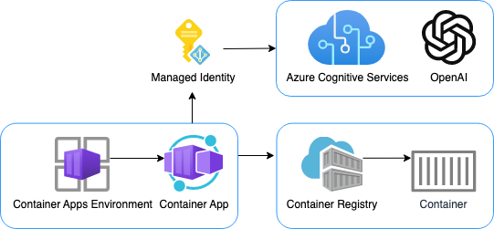

# Chat with GPT models - FastAPI backend

This repository includes a simple Python FastAPI app that streams responses from Azure OpenAI GPT models.

The repository is designed for use with [Docker containers](https://www.docker.com/), both for local development and deployment, and includes infrastructure files for deployment to [Azure Container Apps](https://learn.microsoft.com/azure/container-apps/overview). 🐳



We recommend first going through the [deployment steps](#deployment) before running this app locally,
since the local app needs credentials for Azure OpenAI to work properly.

## Opening the project

This project has [Dev Container support](https://code.visualstudio.com/docs/devcontainers/containers), so it will be be setup automatically if you open it in Github Codespaces or in local VS Code with the [Dev Containers extension](https://marketplace.visualstudio.com/items?itemName=ms-vscode-remote.remote-containers).

If you're not using one of those options for opening the project, then you'll need to:

1. Create a [Python virtual environment](https://docs.python.org/3/tutorial/venv.html#creating-virtual-environments) and activate it.

2. Install the requirements:

    ```shell
    python3 -m pip install -r requirements-dev.txt
    ```

3. Install the pre-commit hooks:

    ```shell
    pre-commit install
    ```

## Deployment

This repo is set up for deployment on Azure Container Apps using the configuration files in the `infra` folder.

### Prerequisites for deployment

1. Sign up for a [free Azure account](https://azure.microsoft.com/free/) and create an Azure Subscription.
2. Request access to Azure OpenAI Service by completing the form at [https://aka.ms/oai/access](https://aka.ms/oai/access) and awaiting approval.
3. Install the [Azure Developer CLI](https://learn.microsoft.com/azure/developer/azure-developer-cli/install-azd). (If you open this repository in Codespaces or with the VS Code Dev Containers extension, that part will be done for you.)

### Deployment from scratch

1. Login to Azure:

    ```shell
    azd auth login
    ```

2. Provision and deploy all the resources:

    ```shell
    azd up
    ```

    It will prompt you to provide an `azd` environment name (like "chat-app"), select a subscription from your Azure account, and select a [location where OpenAI is available](https://azure.microsoft.com/explore/global-infrastructure/products-by-region/?products=cognitive-services&regions=all) (like "francecentral"). Then it will provision the resources in your account and deploy the latest code. If you get an error or timeout with deployment, changing the location can help, as there may be availability constraints for the OpenAI resource.

3. When `azd` has finished deploying, you'll see an endpoint URI in the command output. Visit that URI, and you should see the chat app! 🎉
4. When you've made any changes to the app code, you can just run:

    ```shell
    azd deploy
    ```

### Adding a frontend

You can pair this backend with a frontend of your choice.
The frontend needs to be able to read NDJSON from a ReadableStream,
and send JSON to the backend with an HTTP POST request.
The JSON schema should conform to the [Chat App Protocol](https://aka.ms/chatprotocol).

Here are frontends that are known to work with this backend:

- [ChatGPT app - VanillaJS frontend](https://github.com/pamelafox/chatgpt-frontend-vanilla)

To pair a frontend with this backend, you'll need to:

1. Deploy the backend using the steps above. Make sure to note the endpoint URI.
2. Open the frontend project.
3. Deploy the frontend using the steps in the frontend repo, following their instructions for setting the backend endpoint URI.
4. Open this project again.
5. Run `azd env set ALLOWED_ORIGINS "https://<your-frontend-url>"`. That URL (or list of URLs) will specified in the CORS policy for the backend to allow requests from your frontend.
6. Run `azd up` to deploy the backend with the new CORS policy.

### Costs

Pricing varies per region and usage, so it isn't possible to predict exact costs for your usage.
The majority of the Azure resources used in this infrastructure are on usage-based pricing tiers.
However, Azure Container Registry has a fixed cost per registry per day.

You can try the [Azure pricing calculator](https://azure.com/e/2176802ea14941e4959eae8ad335aeb5) for the resources:

- Azure OpenAI Service: S0 tier, ChatGPT model. Pricing is based on token count. [Pricing](https://azure.microsoft.com/pricing/details/cognitive-services/openai-service/)
- Azure Container App: Consumption tier with 0.5 CPU, 1GiB memory/storage. Pricing is based on resource allocation, and each month allows for a certain amount of free usage. [Pricing](https://azure.microsoft.com/pricing/details/container-apps/)
- Azure Container Registry: Basic tier. [Pricing](https://azure.microsoft.com/pricing/details/container-registry/)
- Log analytics: Pay-as-you-go tier. Costs based on data ingested. [Pricing](https://azure.microsoft.com/pricing/details/monitor/)

⚠️ To avoid unnecessary costs, remember to take down your app if it's no longer in use,
either by deleting the resource group in the Portal or running `azd down`.

## Local development (without Docker)

Assuming you've run the steps in [Opening the project](#opening-the-project) and have run `azd up`, you can now run the FastAPI app locally using the `uvicorn` server:

```shell
python3 -m uvicorn src.app:app --reload
```

### Using a local LLM server

You may want to save costs by developing against a local LLM server, such as
[llamafile](https://github.com/Mozilla-Ocho/llamafile/). Note that a local LLM
will generally be slower and not as sophisticated.

Once you've got your local LLM running and serving an OpenAI-compatible endpoint, define `LOCAL_OPENAI_ENDPOINT` in your `.env` file.

For example, to point at a local llamafile server running on its default port:

```shell
LOCAL_OPENAI_ENDPOINT="http://localhost:8080/v1"
```

If you're running inside a dev container, use this local URL instead:

```shell
LOCAL_OPENAI_ENDPOINT="http://host.docker.internal:8080/v1"
```

## Local development with Docker

In addition to the `Dockerfile` that's used in production, this repo includes a `docker-compose.yaml` for
local development which creates a volume for the app code. That allows you to make changes to the code
and see them instantly.

1. Install [Docker Desktop](https://www.docker.com/products/docker-desktop/). If you opened this inside Github Codespaces or a Dev Container in VS Code, installation is not needed. ⚠️ If you're on an Apple M1/M2, you won't be able to run `docker` commands inside a Dev Container; either use Codespaces or do not open the Dev Container.

2. Make sure that the `.env` file exists. The `azd up` deployment step should have created it.

3. Add your Azure OpenAI API key to the `.env` file if not already there. You can find your key in the Azure Portal for the OpenAI resource, under _Keys and Endpoint_ tab.

    ```shell
    AZURE_OPENAI_KEY="<your-key-here>"
    ```

4. Start the services with this command:

    ```shell
    docker-compose up --build
    ```

5. Click 'http://0.0.0.0:3100' in the terminal, which should open a new tab in the browser. You may need to navigate to 'http://localhost:3100' if that URL doesn't work.
